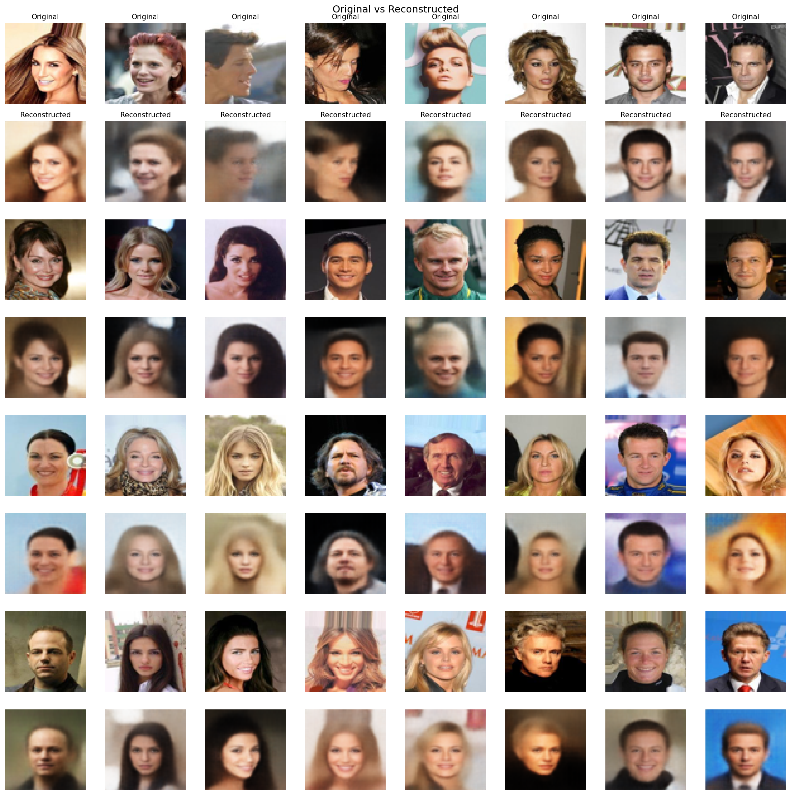
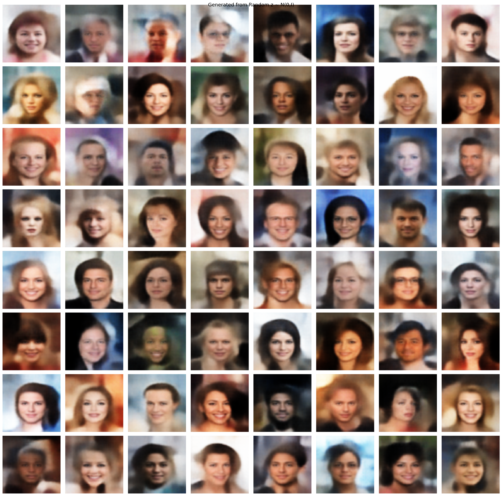
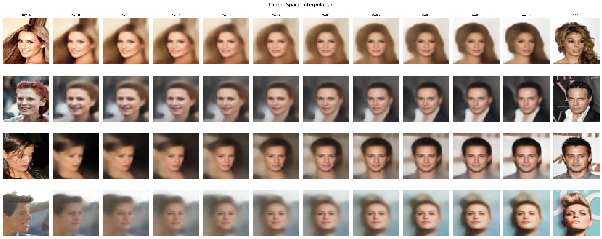
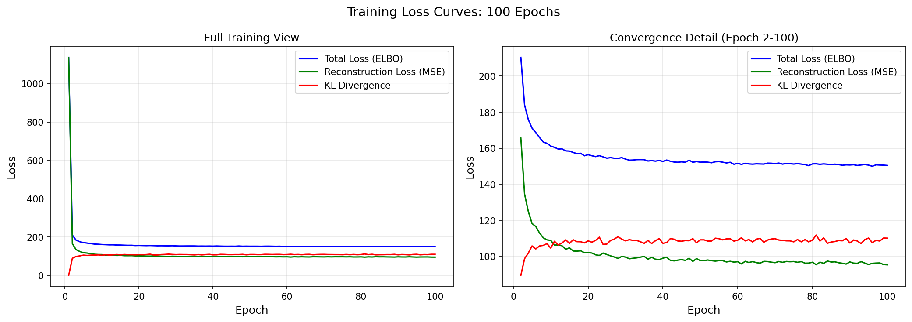

# Convolutional Beta VAE from Scratch in JAX

A Convolutional Variational Autoencoder implemented in JAX, with all  components written manually, including forward passes, backward propagation, and parameter updates.

This project focuses on building and training a complete generative model from scratch by working directly with `jax.numpy` and `jax.lax`, without relying on automatic differentiation or high level neural network libraries. The model was trained on the full CelebA dataset using GPU acceleration.

Full details can be found in the blog -> :

---

## Results


**Evaluation on 1,000 hold out images**

- SSIM: 0.9364  
- PSNR: 22.49 dB  


**Reconstructions :Top row shows original input; bottom row shows the model's reconstructed output.**



**Generated Faces :Faces generated by sampling z~N(0,1) through the custom decoder.**



**Latent Interpolation :Linear transitions between the latent representations of two distinct identities.**



**Training Loss :Tracking ELBO, Reconstruction (MSE), and KL Divergence over 100 epochs.**


---

## Features

Implementation of core components:

- **Conv2D (forward and backward)**  
  [view implementation](model/Encoder.py)

- **TransposedConv2D (forward and backward)**  
  [view implementation](model/Decoder.py)

- **Dense layers with manual gradients**  
  [view implementation](model/Dense.py)

- **Activation functions (ReLU, Sigmoid)**  
  [view implementation](model/Activation.py)

- **Reparameterization trick (μ, σ, ε)**  
  [view implementation](model/Reparameterize.py)

- **ELBO loss (Reconstruction + KL Divergence)**  
  [view implementation](model/ELBO.py)

- **Custom AdamW optimizer(decoupled weight decay)**  
  [view implementation](model/Adam.py)

All gradients and parameter updates are explicitly derived and implemented without autograd

---

## Architecture

**Encoder**
- Conv2D × 3 (kernel=4, stride=2, padding=1)
- ReLU activations
- Flatten
- Dense : μ, log σ²

**Latent Space**
- 128-dimensional Gaussian
- z = μ + σ ⊙ ε

**Decoder**
- Dense projection
- Reshape :(8 × 8 × C)
- TransposedConv2D × 3
- ReLU (hidden)
- Sigmoid (output)

**Objective**
- ELBO:
  - Reconstruction Loss (MSE)
  - KL Divergence
- β = 0.5

---


## Dataset

- CelebA dataset  
- 202,599 images (full dataset)  
- Resolution: 64 × 64  
- Format: CHW tensors  

The model was trained on the complete CelebA dataset using a custom data loader that streams batches directly from disk.

Dataset location:

```
archive/img_align_celeba/img_align_celeba/
```

---

## Setup and Installation

```bash
git clone https://github.com/ojayballer/bvaex.git
cd bvaex
pip install jax jaxlib numpy matplotlib pillow
```

---

## Training

Run training:

```bash
python train.py
```

**Training details**

- GPU: NVIDIA Tesla P100  
- Epochs: 100  
- Batch size: 512  
- Training time: ~2 hours on full dataset  

JAX was used to compile all numerical operations through XLA, allowing the manually implemented layers and gradients to execute efficiently on GPU.

Trained weights are stored in:

```
weights/epoch_100/
```

---


**Note:The reconstructions are slightly blurry because of the MSE-loss,more details in blog.**


Outputs are stored in:

```
results/
```

---

## References

I read the following papers deeply to implement  **bvaex** :-

- [Auto Encoding Variational Bayes](https://arxiv.org/abs/1312.6114)  
- [Adam A Method for Stochastic Optimization](https://arxiv.org/abs/1412.6980)  
